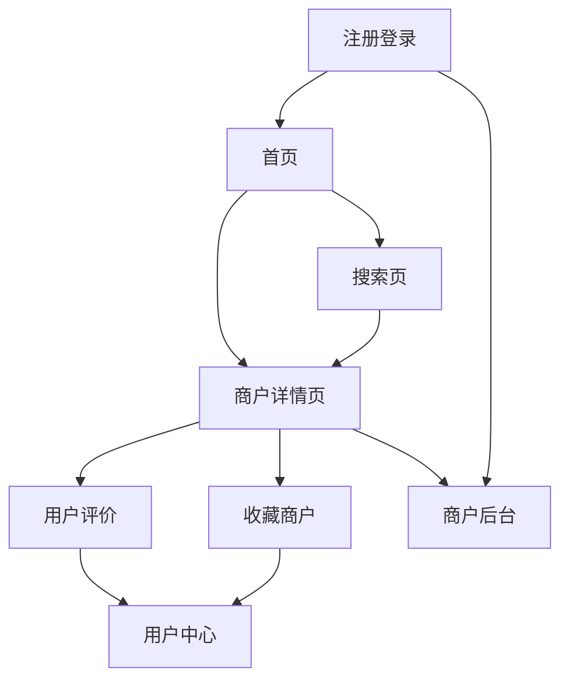

## 1. 产品概述
本地生活服务网站应用，类似大众点评平台，为用户提供商户信息浏览、评价分享、搜索筛选等核心功能。帮助用户发现本地优质商家，同时为商户提供展示和管理平台。

解决用户寻找本地服务商家的痛点，连接消费者与本地商户，打造可信的本地生活服务平台。

## 2. 核心功能

### 2.1 用户角色
| 角色 | 注册方式 | 核心权限 |
|------|----------|----------|
| 普通用户 | 手机号/邮箱注册 | 浏览商户、发布评价、上传图片、搜索筛选 |
| 商户用户 | 邮箱验证注册 | 管理店铺信息、查看评价、查看统计数据 |
| 平台管理员 | 后台创建 | 管理所有商户、审核评价、系统设置 |

### 2.2 功能模块
核心页面包括：
1. **首页**：搜索栏、热门商户推荐、分类导航、附近商户
2. **商户详情页**：商户信息展示、用户评价列表、评分统计
3. **搜索页**：地理位置搜索、筛选条件、搜索结果列表
4. **用户中心**：个人信息、我的评价、收藏商户
5. **商户管理后台**：基本信息管理、评价管理、数据统计
6. **注册登录页**：手机号/邮箱注册、验证码验证

### 2.3 页面详情
| 页面名称 | 模块名称 | 功能描述 |
|-----------|-------------|-------------|
| 首页 | 搜索模块 | 支持关键词搜索、语音输入、热门搜索推荐 |
| 首页 | 商户推荐 | 基于地理位置的热门商户轮播展示 |
| 首页 | 分类导航 | 餐饮、购物、娱乐等服务分类快速入口 |
| 商户详情页 | 基本信息 | 显示商户名称、地址、营业时间、联系方式、服务类别 |
| 商户详情页 | 评分统计 | 展示综合评分、各维度评分、评分分布图 |
| 商户详情页 | 用户评价 | 显示用户评论列表、支持图片浏览、点赞互动 |
| 搜索页 | 地理定位 | 自动获取用户位置、支持手动位置调整 |
| 搜索页 | 筛选功能 | 按距离、评分、价格区间、服务类型筛选 |
| 搜索页 | 结果展示 | 商户卡片列表、地图模式切换、排序选项 |
| 用户中心 | 个人信息 | 头像、昵称、手机号/邮箱管理 |
| 用户中心 | 我的评价 | 历史评价记录、编辑删除功能 |
| 用户中心 | 收藏管理 | 收藏的商户列表、取消收藏功能 |
| 商户后台 | 信息管理 | 编辑商户基本信息、上传营业执照 |
| 商户后台 | 评价管理 | 回复用户评价、举报不当评论 |
| 商户后台 | 数据统计 | 访问量、评分趋势、用户画像分析 |
| 注册登录 | 用户注册 | 手机号/邮箱验证、验证码发送 |
| 注册登录 | 安全登录 | 密码加密存储、自动登录、找回密码 |

## 3. 核心流程

### 用户流程
用户访问首页 → 浏览推荐商户或使用搜索功能 → 查看商户详情 → 进行评价或收藏 → 个人中心管理操作

### 商户流程
商户注册 → 提交认证信息 → 管理店铺信息 → 查看用户评价 → 回复互动和数据分析

## 4. 用户界面设计

### 4.1 设计风格
- **主色调**：橙色(#FF6B35)作为主色，灰色系作为辅助色
- **按钮样式**：圆角矩形设计，主要按钮使用渐变色
- **字体**：中文使用思源黑体，英文字体使用Roboto
- **布局风格**：卡片式布局，顶部导航栏，底部标签栏（移动端）
- **图标风格**：使用线性图标，简洁现代风格

### 4.2 页面设计概述
| 页面名称 | 模块名称 | UI元素 |
|-----------|-------------|-------------|
| 首页 | 搜索栏 | 顶部固定搜索框，圆角设计，搜索图标醒目 |
| 首页 | 商户卡片 | 图片+文字组合，显示评分和价格信息 |
| 商户详情页 | 头部图集 | 轮播图展示商户环境，支持全屏查看 |
| 商户详情页 | 信息区块 | 分模块展示，使用图标+文字组合 |
| 搜索页 | 筛选面板 | 侧边抽屉式筛选，条件分组展示 |
| 用户中心 | 个人信息 | 头像圆形设计，信息分条展示 |
| 商户后台 | 数据面板 | 图表化展示，使用卡片分组 |

### 4.3 响应式设计
- **桌面端优先**：基础设计以PC端为主，最大宽度1200px
- **移动端适配**：断点768px，采用底部导航栏
- **触摸优化**：按钮最小44px，支持滑动操作
- **图片适配**：响应式图片，支持WebP格式

## 5. 技术要求

### 5.1 性能要求
- 页面加载时间 < 3秒
- 图片懒加载和压缩
- 支持CDN加速
- 移动端首屏 < 1MB

### 5.2 安全要求
- HTTPS加密传输
- 用户密码bcrypt加密
- API接口权限验证
- XSS和SQL注入防护
- 图片上传类型和大小限制

### 5.3 测试要求
- 单元测试覆盖率 > 80%
- 核心功能集成测试
- 跨浏览器兼容性测试
- 移动端适配测试
- 性能压力测试