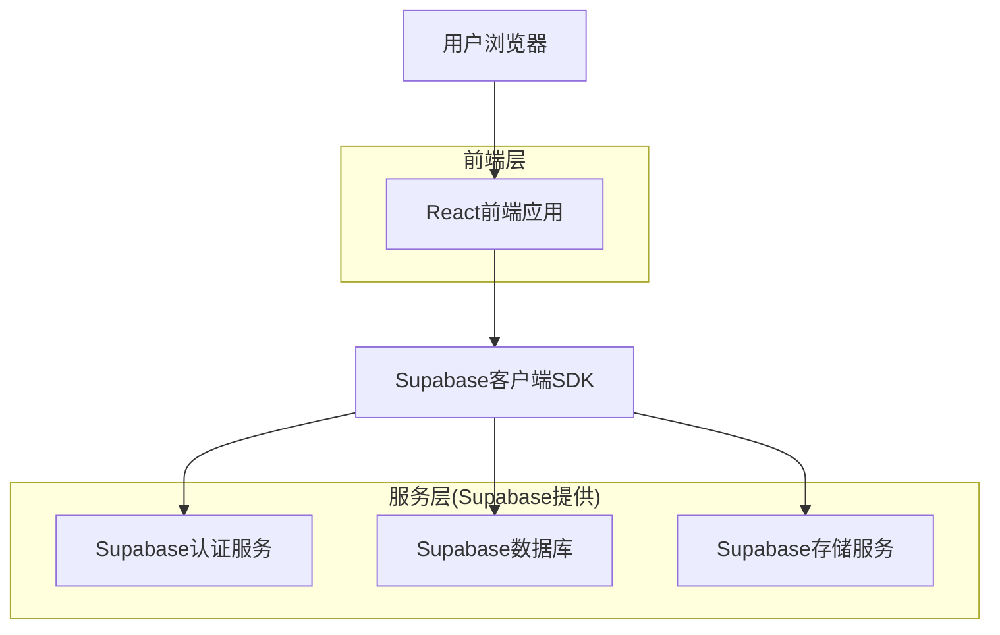
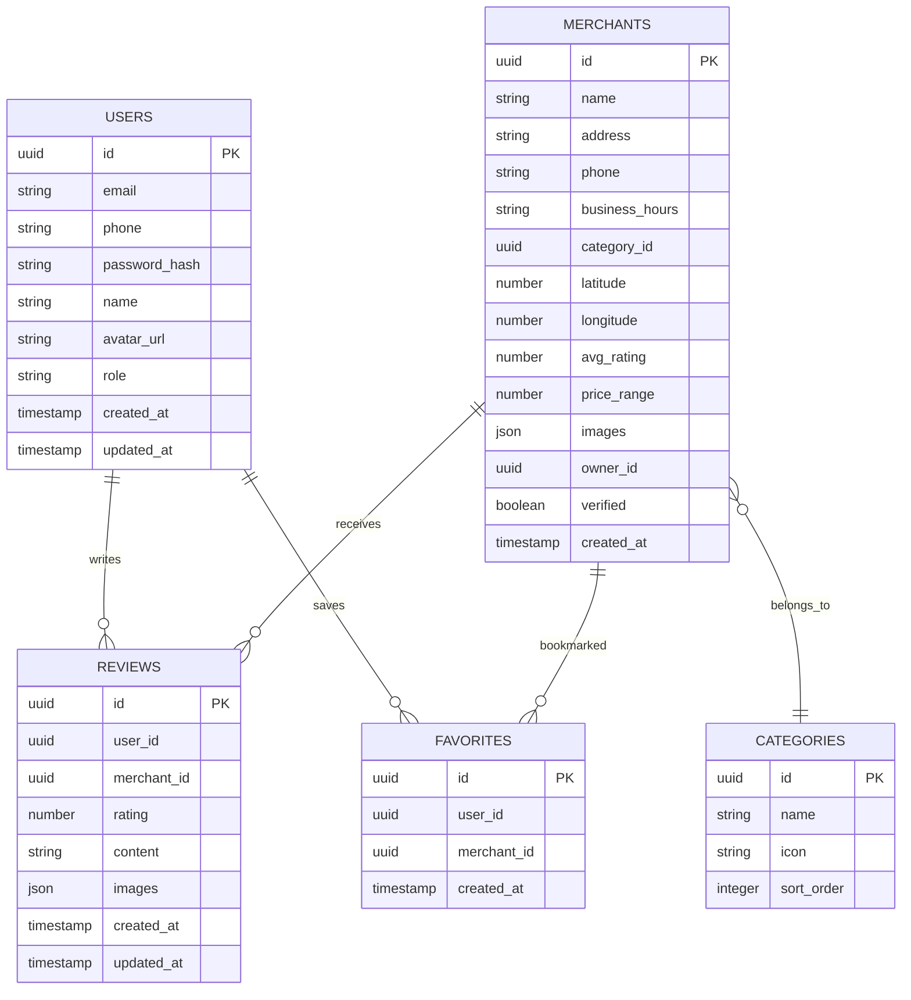

## 1. 架构设计



## 2. 技术描述

* **前端**: React\@18 + TypeScript\@5 + TailwindCSS\@3 + Vite

* **初始化工具**: vite-init

* **后端**: Supabase (BaaS)

* **地图服务**: 高德地图API / 腾讯地图API

* **图片处理**: 浏览器端压缩 + Supabase存储

## 3. 路由定义

| 路由                   | 用途               |
| -------------------- | ---------------- |
| /                    | 首页，展示推荐商户和搜索入口   |
| <br />               | <br />           |
| /search              | 搜索页，支持地理位置和条件筛选  |
| /merchant/:id        | 商户详情页，展示详细信息和评价  |
| /user/profile        | 用户个人中心，管理个人信息和评价 |
| /user/favorites      | 用户收藏夹，管理收藏的商户    |
| /merchant/admin      | 商户管理后台，管理店铺信息和数据 |
| /merchant/reviews    | 商户评价管理，查看和回复用户评价 |
| /auth/login          | 登录页面，支持手机号和邮箱登录  |
| /auth/register       | 注册页面，手机号/邮箱验证注册  |
| /auth/reset-password | 密码重置页面，通过邮箱重置密码  |

## 4. API定义

### 4.1 认证相关API

**用户注册**

```
POST /auth/v1/signup
```

请求参数:

| 参数名        | 类型     | 必填 | 描述        |
| ---------- | ------ | -- | --------- |
| email      | string | 可选 | 邮箱地址      |
| phone      | string | 可选 | 手机号       |
| password   | string | 是  | 密码        |
| redirectTo | string | 可选 | 验证后重定向URL |

**用户登录**

```
POST /auth/v1/token
```

请求参数:

| 参数名      | 类型     | 必填 | 描述   |
| -------- | ------ | -- | ---- |
| email    | string | 可选 | 邮箱地址 |
| phone    | string | 可选 | 手机号  |
| password | string | 是  | 密码   |

### 4.2 商户相关API

**获取商户列表**

```
GET /rest/v1/merchants
```

查询参数:

| 参数名         | 类型     | 必填 | 描述      |
| ----------- | ------ | -- | ------- |
| lat         | number | 可选 | 纬度      |
| lng         | number | 可选 | 经度      |
| radius      | number | 可选 | 搜索半径(米) |
| category    | string | 可选 | 服务类别    |
| min\_rating | number | 可选 | 最低评分    |
| max\_price  | number | 可选 | 最高价格    |

**获取商户详情**

```
GET /rest/v1/merchants?id=eq.{id}
```

**更新商户信息**

```
PATCH /rest/v1/merchants?id=eq.{id}
```

### 4.3 评价相关API

**发布评价**

```
POST /rest/v1/reviews
```

请求参数:

| 参数名          | 类型     | 必填 | 描述      |
| ------------ | ------ | -- | ------- |
| merchant\_id | uuid   | 是  | 商户ID    |
| rating       | number | 是  | 评分(1-5) |
| content      | string | 是  | 评价内容    |
| images       | array  | 可选 | 图片URL数组 |

**获取评价列表**

```
GET /rest/v1/reviews
```

## 5. 数据模型

### 5.1 数据模型定义



### 5.2 数据定义语言

**用户表(users)**

```sql
-- 创建用户表
CREATE TABLE users (
    id UUID PRIMARY KEY DEFAULT gen_random_uuid(),
    email VARCHAR(255) UNIQUE,
    phone VARCHAR(20) UNIQUE,
    password_hash VARCHAR(255) NOT NULL,
    name VARCHAR(100) NOT NULL,
    avatar_url TEXT,
    role VARCHAR(20) DEFAULT 'user' CHECK (role IN ('user', 'merchant', 'admin')),
    created_at TIMESTAMP WITH TIME ZONE DEFAULT NOW(),
    updated_at TIMESTAMP WITH TIME ZONE DEFAULT NOW()
);

-- 创建索引
CREATE INDEX idx_users_email ON users(email);
CREATE INDEX idx_users_phone ON users(phone);
```

**商户表(merchants)**

```sql
-- 创建商户表
CREATE TABLE merchants (
    id UUID PRIMARY KEY DEFAULT gen_random_uuid(),
    name VARCHAR(200) NOT NULL,
    address TEXT NOT NULL,
    phone VARCHAR(20),
    business_hours TEXT,
    category_id UUID REFERENCES categories(id),
    latitude DECIMAL(10, 8),
    longitude DECIMAL(11, 8),
    avg_rating DECIMAL(3, 2) DEFAULT 0,
    price_range INTEGER CHECK (price_range BETWEEN 1 AND 4),
    images JSON DEFAULT '[]',
    owner_id UUID REFERENCES users(id),
    verified BOOLEAN DEFAULT FALSE,
    created_at TIMESTAMP WITH TIME ZONE DEFAULT NOW(),
    updated_at TIMESTAMP WITH TIME ZONE DEFAULT NOW()
);

-- 创建空间索引
CREATE INDEX idx_merchants_location ON merchants USING GIST (
    ST_MakePoint(longitude, latitude)
);
CREATE INDEX idx_merchants_category ON merchants(category_id);
CREATE INDEX idx_merchants_rating ON merchants(avg_rating DESC);
```

**评价表(reviews)**

```sql
-- 创建评价表
CREATE TABLE reviews (
    id UUID PRIMARY KEY DEFAULT gen_random_uuid(),
    user_id UUID REFERENCES users(id) ON DELETE CASCADE,
    merchant_id UUID REFERENCES merchants(id) ON DELETE CASCADE,
    rating INTEGER CHECK (rating BETWEEN 1 AND 5),
    content TEXT,
    images JSON DEFAULT '[]',
    created_at TIMESTAMP WITH TIME ZONE DEFAULT NOW(),
    updated_at TIMESTAMP WITH TIME ZONE DEFAULT NOW(),
    UNIQUE(user_id, merchant_id)
);

-- 创建索引
CREATE INDEX idx_reviews_merchant ON reviews(merchant_id, created_at DESC);
CREATE INDEX idx_reviews_user ON reviews(user_id, created_at DESC);
```

**分类表(categories)**

```sql
-- 创建分类表
CREATE TABLE categories (
    id UUID PRIMARY KEY DEFAULT gen_random_uuid(),
    name VARCHAR(100) NOT NULL UNIQUE,
    icon VARCHAR(100),
    sort_order INTEGER DEFAULT 0,
    created_at TIMESTAMP WITH TIME ZONE DEFAULT NOW()
);

-- 初始化数据
INSERT INTO categories (name, icon, sort_order) VALUES
('餐饮美食', 'restaurant', 1),
('购物', 'shopping', 2),
('娱乐休闲', 'entertainment', 3),
('生活服务', 'service', 4),
('酒店住宿', 'hotel', 5);
```

**收藏表(favorites)**

```sql
-- 创建收藏表
CREATE TABLE favorites (
    id UUID PRIMARY KEY DEFAULT gen_random_uuid(),
    user_id UUID REFERENCES users(id) ON DELETE CASCADE,
    merchant_id UUID REFERENCES merchants(id) ON DELETE CASCADE,
    created_at TIMESTAMP WITH TIME ZONE DEFAULT NOW(),
    UNIQUE(user_id, merchant_id)
);

-- 创建索引
CREATE INDEX idx_favorites_user ON favorites(user_id, created_at DESC);
CREATE INDEX idx_favorites_merchant ON favorites(merchant_id);
```

## 6. Supabase权限配置

**匿名用户权限**

```sql
-- 商户读取权限
GRANT SELECT ON merchants TO anon;
GRANT SELECT ON categories TO anon;
GRANT SELECT ON reviews TO anon;

-- 评价聚合查询权限
GRANT SELECT ON reviews TO anon;
```

**认证用户权限**

```sql
-- 用户表权限
GRANT ALL ON users TO authenticated;
GRANT ALL ON merchants TO authenticated;
GRANT ALL ON reviews TO authenticated;
GRANT ALL ON favorites TO authenticated;

-- 评价插入策略
CREATE POLICY "用户只能插入自己的评价" ON reviews
    FOR INSERT WITH CHECK (auth.uid() = user_id);

-- 评价更新策略  
CREATE POLICY "用户只能更新自己的评价" ON reviews
    FOR UPDATE USING (auth.uid() = user_id);

-- 评价删除策略
CREATE POLICY "用户只能删除自己的评价" ON reviews
    FOR DELETE USING (auth.uid() = user_id);

-- 收藏权限策略
CREATE POLICY "用户只能管理自己的收藏" ON favorites
    USING (auth.uid() = user_id);
```

## 7. 性能优化策略

### 7.1 前端优化

* 路由懒加载

* 图片压缩和WebP格式

* 虚拟滚动列表

* 浏览器缓存策略

* CDN加速静态资源

### 7.2 数据库优化

* 合理使用索引

* 评价数据分页查询

* 商户评分缓存机制

* 地理位置查询优化

* 定期数据归档

### 7.3 安全措施

* JWT令牌认证

* API请求频率限制

* 图片上传类型检查

* XSS攻击防护

* SQL注入防护

